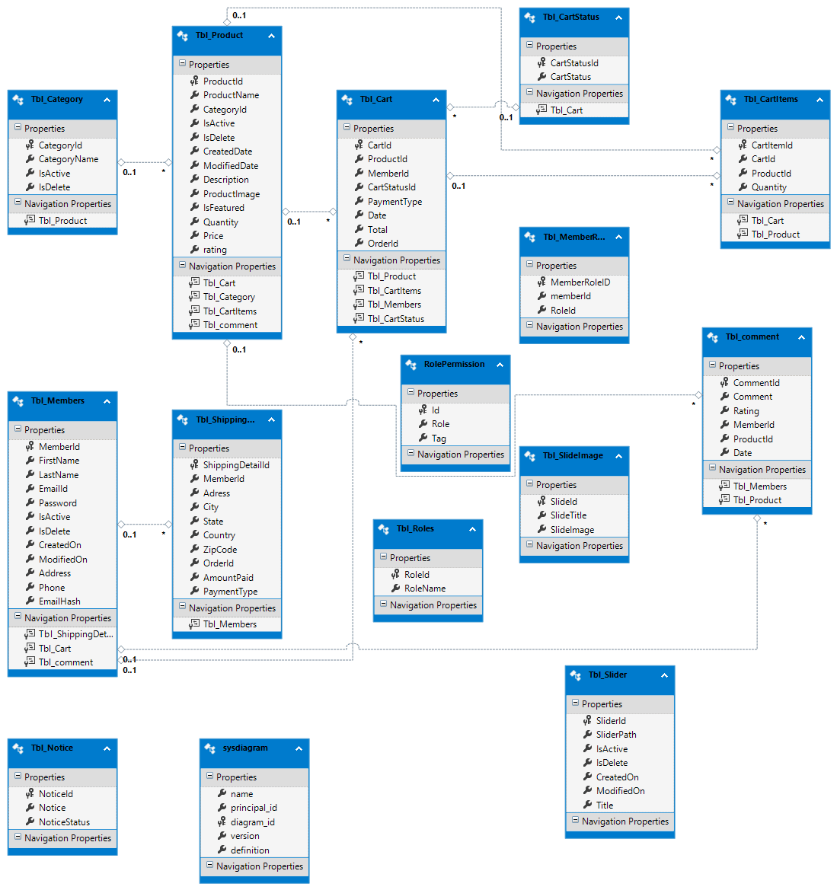

# mothercare
"Mother Care - For your Loved Ones" is offering an emergency health care solution for pregnant women. As we are 
passing through a pandemic, it’s really difficult sometimes finding emergency products and maternity 
instruments. So here is all of them as an online shop. 

    The project took almost 13 days to shape like the video provided below.

## Used
  Frontend  | Backend
  ------------- | -------------
  Html  | C#
  CSS/SCSS/LESS  | SQL
  Javascript | 
  Bootstrap | 
  JQuery |
  Ajax | 
  
    Framework:  ASP.Net MVC
 
## Key Features
  - Admin’s Perspective - 
    - Add products, categories and slides. 
    - Change the status of orders. 
    - Customize products. 
    - Customize notices.  
   
  - User’s Perspective - 
    - Can buy maternity products from shop. 
    - Can rate confirmed products. Fully functional dynamic rating system.  
    - Can search products by their category or rating.  
    - Paypal payment gateway integrated.

## ERD

## Details

